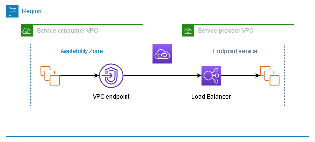

#### VPC Endpoint
- VPC endpoints are used to privately connect your vpc to a specific aws service (s3, sns) without using public internet. Forexample, if sqs queue in a vpc A wants to connect to s3 bucket to fetch some data, we can create a vpc endpoint for s3 and sqs within vpc A can use it to access it. Traffic wont go through internet. 
- This way, we donot require NAT and internet gateway to access a specific aws service.

#### VPC Endpoint Service
- To make a service available in a region, endpoint service is created. For example, my microservice is running on eks cluster. To make is available in eu-west-1 region to be used by service consumers, we have to create endpoint service for my microservice.
- To create a endpoint service, a load balancer is required which routes the traffic from consumer to your service.

#### VPC endpoint service domain name
- Simply, a DNS name for your vpc endpoint service.

#### Hosted Zone
- A list of A/C records in Amazon Route 53 to define how we want to route traffic for a specific domain.
- In a hosted zone, we have DNS records (A or C).
- Public hosted zone makes our domains publically avaialble over internet.
- Private hosted zone makes our domains avaialble only within a specific vpc. 

#### Latency based vs simple routing policies
- Simple routing: Straight forward routing which routes traffic to a single resource.
- Latency based routing: Used when we have resources in multiple regions ans we want to route traffic to the region that provides lowest latency. This ensures the improved performance for your users.

#### Target Group
- A logical grouping of resources that we want to route to through a load balancer.
